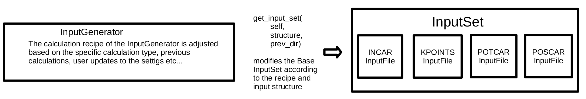

# InputSets and Generators in atomate2

## Overview - InputFiles/Sets/Generators

Most ab-initio codes rely on input files read from disk. The `InputSet` class automates the writing of these files and provides a standard set of parameters that work for the large majority of calculations of a specific type.

`InputSet` are generally developed as part of [pymatgen](https://pymatgen.org/pymatgen.io.html#module-pymatgen.io.core), which provides a three-tiered hierarchy of classes for reading and writing input files:


- The `InputFile` class, inheriting from `MSONable`, encapsulates the data for a specific input file, such as an INCAR file. It offers a uniform approach to handling file reading and writing tasks.
- As a dictionary-like collection, the `InputSet` associates file names (the keys) with their content (which can be either simple strings or `InputFile` instances). The main methods of this class are `write_input()` for standardized file writing and `from_directory()` to read in pre-existing `InputSets`. The `validate()` method confirms the validity of the `InputSet`.
- `InputGenerators` implement the `get_input_set()` method, which provides the recipe, i.e., logic to return a suitable `InputSet` for a `Molecule`, `Structure`, or another set of atomic coordinates. During the initialization of an `InputGenerator` additional inputs can be provided that adjust the recipe.

While generally the input classes are supposed to be part of `pymatgen` during development it is recommended to include them in `atomate2` at first to facilitate rapid iteration. Once mature, they can be moved to `pymatgen` or to a `pymatgen` [addon package](https://.org/addons). When implementing your own input classes take note of the recommendations and rules in the pymatgen documentation [[1](https://pymatgen.org/pymatgen.io.html#module-pymatgen.io.core), [2](https://pymatgen.org/pymatgen.io.vasp.html#module-pymatgen.io.vasp.sets)].

The `InputGenerators` interact with the atomate2 workflows through `Makers`. Each `Maker` for a code that requires input files, sets its `input_set_generator` parameter during initialization. For example, for the `RelaxMaker`, the default `input_set_generator` is the `RelaxSetGenerator`, but of course, users can provide or modify any `VaspInputGenerator` and provide it as input to a Maker.

In the following, we will delve into the specifics of how `InputSets` and `InputGenerators` are used in atomate2, showcasing the `VaspInputGenerator` and `VaspInputSet` as examples.

## Example: VaspInputFiles/Sets/Generators
```{Note}
Note that for historical reasons there is some inconsistency in the naming scheme of the Vasp classes.The `VaspInputSet` class in pymatgen corresponds to an `InputGenerator` class and to be consistent with atomate2 it has an alias `VaspInputGenerator`. We will refer to it by its alias. Due to the same reason, what would normally be the `InputSet` class is named `VaspInput`.
```
The `VaspInput` class, defined in the `pymatgen.io.vasp.inputs` module, consists of an `INCAR`, `KPOINTS`, `POSCAR`, and `POTCAR` object, i.e., all the files required to run a VASP calculation. While these inherit from `MSONable` when adding `InputFiles` for a new code the `InputFile` class should be used.

The base `VaspInput` implements the standard methods `write_input()` to write the respective files to a directory, `from_directory()` to read in an `InputSet` from a previous calculation, and `is_valid()` to confirm the internal consistency of the `VaspInputSet`.
The `VaspInputGenerator` defines all the logic required to generate input files for the materials project, `atomate2` and other VASP workflows.

Default `InputSets` are defined as YAML files in `pymatgen.io.vasp`. The input files in atomate2 are generated starting from the `_BASE_VASP_SET` as the default that implements some changes to the `MPRelaxSet` and `MPScanRelaxSet`.

 For VASP, `atomate2` provides default settings for PBEsol calculations as well as settings for PBE and R2Scan calculations with the parameters of the Materials Project and some legacy settings compatible with atomate1 (e.g. equation of state workflow). These default `InputSets` combined with the logic in the respective `InputGenerator` aim to be reliable for a large majority of calculations.

The `VaspInputGenerator` applies multiple layers of modifications to the default settings, taking into account results from provided previous calculations, the specific type of calculation being conducted, user inputs, and the input `Structure`.

Generally, the priority of the different updates is as follows (from lowest to highest):


`InputSet` information from previous calculations are typically read in by providing the path to a folder of a previous calculation when using the `make` method of a `Maker` which is then forwarded to the `_get_previous()` method of the `VaspInputGenerator`. This is discussed in detail in the tutorial on [chaining vasp workflows](https://github.com/materialsproject/atomate2/blob/main/docs/user/codes/vasp.md#connecting_vasp_jobschaining-workflows).

Additionally, various _auto_ settings, such as `auto_ismear` and `auto_ispin`, are designed to automatically adjust the `InputSet` based on outcomes from prior calculations or the specific structure being calculated.

 ```{Note}
Note that combining auto_updates with user-provided updates can introduce unexpected errors into workflows__.
For example, setting the __ALGO__ keyword to __ALL__ while also enabling `auto_ismear=True` may result in
an error if the structure is identified as an insulator. This is because `ISMEAR` would be set to use the
tetrahedron method, which is not compatible with __ALGO__=__ALL__.
```

 Each basic calculation type has an associated `InputGenerator` that inherits all the logic of `VaspInputGenerator`. For VASP, a wide variety of `InputGenerators` are implemented, ranging from the standard `StaticSetGenerator` to `InputGenerators` for MD simulations. Each of these generators implements at least the `get_incar_updates()` method and often also the `get_kpoints_updates()` method. These methods are tasked with applying the changes specific to each type of calculation. For instance, they might set relaxation parameters in an `INCAR` file for a relaxation calculation, or configure a non-self-consistent field calculation for a band structure workflow. In the simplest example, the `RelaxSetGenerator` only applies 4 updates to the INCAR to allow for an ionic relaxation and stop VASP from saving the charge density:

```py
@dataclass
class RelaxSetGenerator(VaspInputGenerator):
    """Class to generate Vasp relaxation input sets."""

    def get_incar_updates(
        self,
        structure: Structure,
        prev_incar: dict = None,
        bandgap: float = None,
        Vasprun: Vasprun = None,
        outcar: Outcar = None,
    ) -> dict:
        """
        Get updates to the INCAR for a relaxation job.

        Parameters
        ----------
        structure
            A structure.
        prev_incar
            An incar from a previous calculation.
        bandgap
            The band gap.
        Vasprun
            A Vasprun from a previous calculation.
        outcar
            An outcar from a previous calculation.

        Returns
        -------
        dict
            A dictionary of updates to apply.
        """
        return {"NSW": 99, "LCHARG": False, "ISIF": 3, "IBRION": 2}
```
 Upon initializing a `VaspInputGenerator`, users have the option to specify their own `user_incar_settings`, `user_kpoints_settings`, and `user_potcar_settings`.
 There are several options on how to provide these user updates to `InputSets`/`InputGenerators`. They are discussed in detail in the tutorial on [modifying `InputSets`](https://materialsproject.github.io/atomate2/user/codes/Vasp.html#modifying-input-sets).

 ```{warning}
 When developing your own workflow, it is crucial that updates provided by the user supersede any default
 or workflow-specific settings. Ensure this behavior is validated through testing when developing a
 custom InputGenerator.
```

Finally, update instructions can also be written to the `~/.atomate2.yaml` under `VASP_INCAR_UPDATES`. These will even overwrite user updates as they are applied outside of the logic of the InputGenerator in the `write_vasp_input_set()` function. However, these updates are usually intended to customize the workflows for different machines, e.g., set parallelization options and not to change the recipe of the workflow.

The primary structure-dependent components of the `VaspInputGenerator` involve the configuration of DFT+U parameters, k-point densities, pseudo-potentials and magnetic moments based on the structure. When implementing `InputGenerators` the latter needs special attention as `pymatgen`/`atomate2` allow for several ways to associate spins with structures and a clear order of priority needs to be established, documented and tested.
