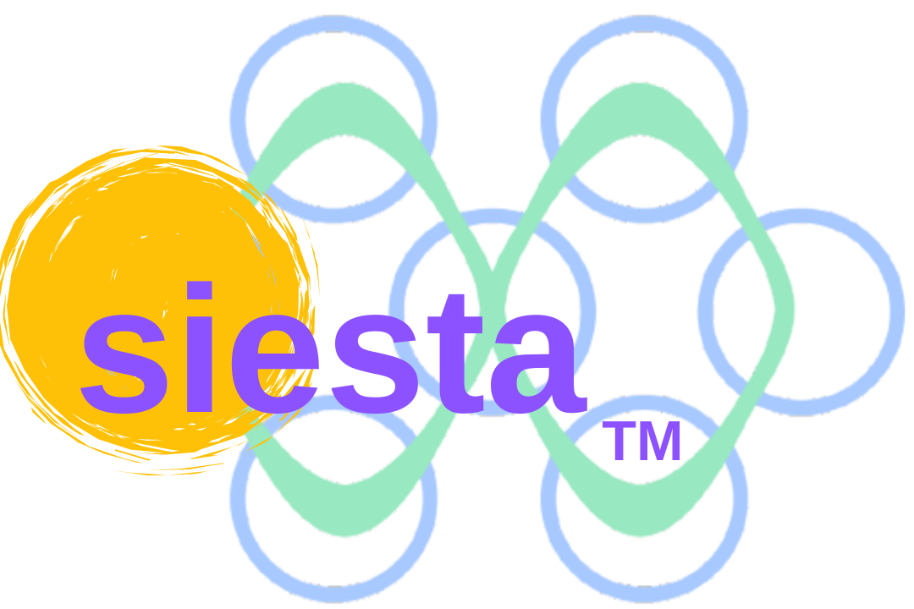

.. atomate2siesta documentation master file

===============================================
atomate2siesta: Automated SIESTA Workflows
===============================================

|

**Powerful, production-ready computational materials science workflows with SIESTA and Atomate2**

.. highlights::

   atomate2siesta integrates the quantum chemistry code SIESTA with the Atomate2 workflow
   framework, providing automated, scalable, and reproducible materials simulations with
   intelligent error recovery and extensive analysis tools.

----

Quick Links
===========

* 🚀 **Quickstart**: `5-Minute Tutorial <https://github.com/arsalan-akhtar/atomate2siesta/blob/main/tutorials/QUICKSTART.md>`_ - Your first calculation
* 📖 **Installation**: :doc:`installation` - Installation guide and basic setup
* 🛠️ **CLI Tools**: :doc:`cli-tools` - Database management, cluster setup, and job submission
* 📚 **Learning Paths**: :doc:`tutorials/index` - Structured guides from basics to advanced workflows
* 📖 **Tutorials**: :doc:`tutorials-index` - 195+ hands-on tutorials with complete examples
* ⚡ **Features**: :doc:`features` - Latest enhancements: Phonons, Surface Energy, Tier System
* 🔧 **Advanced Workflows**: :doc:`advanced-workflows` - Complex multi-step calculations
* 🆘 **Troubleshooting**: :doc:`troubleshooting` - Common issues and solutions
* 📋 **Cheat Sheets**: `Quick References <https://github.com/arsalan-akhtar/atomate2siesta/tree/main/docs/cheatsheets>`_ - Workflows, CLI, Parameters

----

Documentation Contents
======================

.. toctree::
   :maxdepth: 2
   :caption: Getting Started

   introduction
   installation
   usage
   fdf-parameters
   schemas
   troubleshooting

.. toctree::
   :maxdepth: 2
   :caption: CLI Tools

   cli-tools
   cli-database
   cli-cluster-setup
   cli-jobflow-remote
   jobflow-remote-rerun-failed-jobs
   siesta-pseudos
   siesta-inputs

.. toctree::
   :maxdepth: 2
   :caption: Key Features

   features
   makers-vs-flowmakers
   recipe-book
   tier-system
   tier-system-clarification
   tier-defaults-explained
   module-registry-explained
   custodian
   advanced-workflows
   defaults

.. toctree::
   :maxdepth: 2
   :caption: Learning Paths

   tutorials/index

.. toctree::
   :maxdepth: 2
   :caption: Tutorials (Hands-On)

   tutorials-md/QUICKSTART.md
   tutorials-md/README.md
   tutorials-index

.. toctree::
   :maxdepth: 2
   :caption: API Reference

   api/modules

.. toctree::
   :maxdepth: 1
   :caption: Development

   contributing
   changelog

----

Key Capabilities
================

🎯 **Automated Workflows**
   • Structure relaxation (fixed/variable cell)
   • Band structure and DOS calculations
   • Equation of State (EOS) fitting
   • Elastic constants and mechanical properties
   • Nudged Elastic Band (NEB) transition states
   • Phonon calculations with phonopy integration
   • Surface energy calculations
   • Optical properties

🧠 **Intelligent Error Recovery**
   • Automatic detection of 10+ error types
   • Progressive correction strategies
   • SCF convergence rescue (5-level approach)
   • Memory and time limit handling
   • Built on MaterialsProject/custodian library

⚙️ **Tier-Based Input Architecture**
   • 5 complexity tiers: dirty → basic → intermediate → advanced → expert
   • 33 dataclass modules for parameter organization
   • 32 material-specific presets across 10 categories
   • Automatic module activation based on complexity

📊 **Rich Analysis & Visualization**
   • Publication-quality plots (phonons, EOS, surfaces)
   • Comprehensive text summaries
   • JSON outputs for programmatic access
   • Convergence tracking and validation

🔬 **Production-Ready**
   • HPC cluster support (SLURM, PBS, SGE)
   • Database integration (MongoDB/Maggma)
   • Comprehensive test suite (1,513 tests, 58-60% coverage, ~100% passing)
   • Performance benchmarked (< 25ms overhead)

----

Latest Enhancements (2025)
==========================

**Test Coverage Foundation** (2025)
   Major testing initiative: 1,513 tests achieving 58-60% coverage.
   Critical infrastructure comprehensively tested: parser, file_client (86%),
   task schemas (97%). Established mock-based testing patterns for future development.

**Grüneisen Parameters & Thermal Expansion**
   Complete visualization suite with 6 plotting functions for Grüneisen parameter analysis.
   Temperature-dependent thermal expansion calculation using Debye model. Publication-quality
   plots (300 DPI) with physical interpretation and material classification.

**Thermal Expansion Analysis**
   Enhanced Grüneisen parameter workflows with comprehensive thermal property calculations.
   Seamless dict/Pydantic compatibility for testing and production use.

**Code Quality & Tier System Refinement**
   TODO cleanup (42 → 16, 62% reduction). Added missing tier system classmethods.
   Eliminated initialization warnings. Enhanced dataclass validation docstrings.

**Tier-Based Input Architecture**
   Complete module registry system with automatic initialization based on calculation
   complexity. 32 material-specific presets across 10 categories for common calculation types.

**Custodian Error Handling**
   Refactored to use MaterialsProject/custodian library. Automatic error detection and
   recovery with JSON logging and validation framework.

**Phonon & Surface Energy**
   Full phonopy integration with automatic plotting. Multi-surface energy workflows with
   symmetry analysis and comprehensive documentation.

.. seealso::

   Full development history in :doc:`changelog`

----

Community & Support
===================

📖 **Documentation**: https://atomate2siesta.readthedocs.io

🐛 **Bug Reports**: https://github.com/arsalan-akhtar/atomate2siesta/issues

💬 **Discussions**: https://github.com/arsalan-akhtar/atomate2siesta/discussions

🤝 **Contributing**: See :doc:`contributing` for guidelines

----

Indices and Tables
==================

* :ref:`genindex`
* :ref:`modindex`
* :ref:`search`
