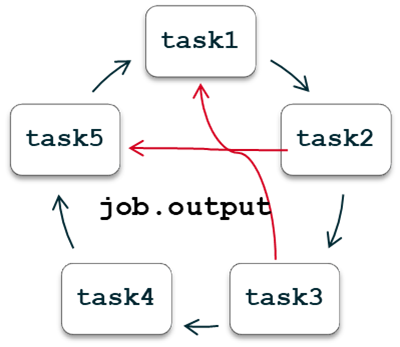

(key_concepts_overview)=

# Key concepts in atomate2: `Job` & `Flow` `Makers`, `InputSet`, `TaskDocument`, and `Builder`

# Introduction
This tutorial will give you a high-level overview of the key concepts in atomate2, diving into the important features of `Job` and `Flow` makers, as well as `InputSets`, `TaskDocuments`, and `Builders`.

## `Job` and `Flow` makers

`Job` and `Flow` makers are the workhorses of the atomate2 code framework. Their key role is to enable the user to execute a sequence of usually repetitive tasks and processes.
To ease the management of such processes, tools like [jobflow](https://github.com/materialsproject/jobflow) can be used. The two essential building blocks of jobflow-based workflows in atomate2 are `Jobs` and `Flows`.

### Basics

A `Job` is a single computing job, and potentially can take any python function form, given that their inputs and outputs (return values) can be serialized in a JSON format.

A `Flow` is a sequential collection of job or other flow objects. The connectivity and also execution order of the different jobs and flow is decided automatically from the job inputs. The output from one job (`job.output`) can be used as the input for the next one, which will therefore establish a connectivity between these two jobs. The connectivity between several jobs and flows can be arbitrary, depending on the purpose of the workflow.


`Job` and `Flow` makers come in handy by providing a template schema to set up all kinds of computational chemistry tasks (e.g. chemical bonding analysis, elastic constant calculations, force field applications and many more) and to make it easier to handle and unify output from the various supported software packages (like VASP, phonopy and more). <!--is there a list of supported software on the GitHub pages?-->
Because the job output data is stored in a JSON serializable dict format, it makes it possible to conveniently handle it with so-called `TaskDocuments`.<!--hyperref to TaskDoc-->

### Technical Aspects

The atomate2 `Job` and `Flow` makers are both dataclasses that inherit from the `Maker` [jobflow](https://github.com/materialsproject/jobflow/blob/main/src/jobflow/core/maker.py) dataclass.
The `Maker` class from jobflow is a base class for constructing the aforementioned `Job` and `Flow` objects and has two main functionalities, that are vital for any inheriting job or flow maker: the `make` function and the functionality to update keyword arguments (kwargs).

```
@dataclass
class Maker(MSONable):
    """
    Base maker (factory) class for constructing :obj:`Job` and :obj:`Flow` objects.
    [...]
    """
    def make(...) -> jobflow.Flow | jobflow.Job:
        """Make a job or a flow - must be overridden with a concrete implementation."""
        raise NotImplementedError
    [...]
    def update_kwargs(...):
```

If one needs to implement a new job or flow maker, it is important to pay attention to the functions that raise an `NotImplementedError`. Functions like the `make` function have to be overridden for each specific job or flow maker with its own specific functionalities.

### Examples

An example for a `Job Maker` is the `LobsterMaker`:

```
@dataclass
class LobsterMaker(Maker):
    """
    LOBSTER job maker.
    [...]
    """
    name: str = "lobster"
    [...]

    @job(output_schema=LobsterTaskDocument, data=[CompleteCohp, LobsterCompleteDos])
    def make(
        self,
        wavefunction_dir: str | Path = None,
        basis_dict: dict | None = None,
    ) -> LobsterTaskDocument:
        """
        Run a LOBSTER calculation.
        [...]
        """
```
This class incorporates [LOBSTER](http://cohp.de/) specific input and output data, i.e. the `wavefunction_dir` and `basis_dict` as input in `make` that returns the `LobsterMaker`-class specific output as a `TaskDocument`.
As a job maker, this maker will then create jobs to execute the LOBSTER runs and store the output in the `LobsterTaskDocument` format.

In contrast to a job maker, the `make` function of a `Flow Maker` will return a `Flow` object instead of a task document.
As an example we take the `BasePhononMaker` (that can be used in combination with VASP or the various (machine learned) force fields):
```
@dataclass
class BasePhononMaker(Maker, ABC):
    """
    Maker to calculate harmonic phonons with a DFT/force field code and Phonopy.

    [...]
    """

    name: str = "phonon"
    [...]

    def make(...) -> Flow:
```
This maker will return a flow that provides all the necessary steps and subroutines that are needed to complete the phonon calculations.
Oftentimes, such flows then involve dynamic jobs, as e.g. for the phonon calculations, the number of supercells with individual atomic displacements will be decided upon runtime.
In this particular case, the flow maker `BasePhononMaker` is also inheriting from `ABC` (Abstract Base Classes). <!--more comprehensive explanation on ABCs?-->


# InputSet
tbc

# TaskDocument
a TaskDocument (TaskDoc for short) is a dictionary object that contains all the information of the respective computational chemistry calculation run.

tbc

# Builder
tbc

#TODO exercises?
