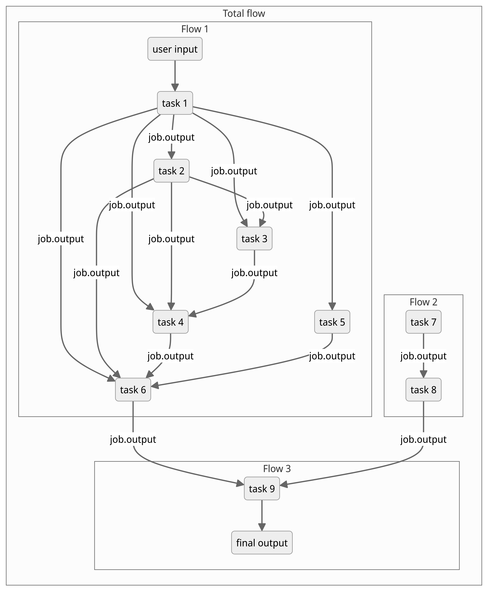

(key_concepts_overview)=

# Key concepts in atomate2: `Job` & `Flow` `Makers`, `InputSet`, `TaskDocument`, and `Builder`

# Introduction
This tutorial will give you a comprehensive high-level overview of the key concepts in atomate2, diving into the important features of `Job` and `Flow` makers, as well as `InputSets`, `TaskDocuments`, and `Builders`.

## `Job` and `Flow` makers

`Job` and `Flow` makers are the workhorses of the atomate2 code framework. Their key role is to enable the user to orchestrate and execute a sequence of usually repetitive tasks, processes and manage computational workflows.
To streamline the management of such processes, tools like [jobflow](https://github.com/materialsproject/jobflow) can be used. The two essential building blocks of the jobflow-based workflows in atomate2 are `Jobs` and `Flows`.

### Basics

A `Job` is a single computing job, and potentially can take any python function form, given that their inputs and outputs (return values) can be serialized in a JSON format. Jobs are defined using the `@job` decorator.

A `Flow` is a sequential collection of job or other flow objects. The connectivity and also execution order and dependencies of the different jobs and flow is decided automatically from the job inputs. The output from one job (`job.output`) can be used as the input for the next one. This will therefore establish a connectivity between these two jobs.
The connectivity between several jobs and flows can be arbitrary, depending on the purpose of the workflow.

The diagram below illustrates a very general example of a flow (Total flow) comprised of several other flows. Each flow integrates several individual jobs or tasks, connected by the respective `job.output`.



`Job` and `Flow` makers come in handy by providing a template schema to set up diverse electronic structure calculation and computational chemistry tasks (e.g. chemical bonding analysis, elastic constant calculations, force field applications and many more) and to make it easier to handle and unify output from the various supported software packages (like VASP, phonopy and more).
Given that the job output data is stored in a JSON serializable dict format, it makes it possible to conveniently handle the final output with so-called [`TaskDocuments`](#taskdocument).

### Technical Aspects

The atomate2 `Job` and `Flow` makers are both dataclasses that inherit from the `Maker` [jobflow](https://github.com/materialsproject/jobflow/blob/main/src/jobflow/core/maker.py) dataclass.
The `Maker` class from jobflow is a base class for constructing the aforementioned `Job` and `Flow` objects. It has two main functionalities, that are vital for any inheriting job or flow maker: the `make` function and the functionality to update keyword arguments (kwargs).

```
@dataclass
class Maker(MSONable):
    """
    Base maker (factory) class for constructing :obj:`Job` and :obj:`Flow` objects.
    [...]
    """
    def make(...) -> jobflow.Flow | jobflow.Job:
        """Make a job or a flow - must be overridden with a concrete implementation."""
        raise NotImplementedError
    [...]
    def update_kwargs(...):
```

When implementing a new job or flow maker, it's crucial to take care of the functions that raise an `NotImplementedError`. Functions like the `make` function have to be overridden for each specific job or flow maker with its own specific functionalities.

### Examples

Let's have a closer look at the `LobsterMaker` as an example for a `Job Maker`:

```
@dataclass
class LobsterMaker(Maker):
    """
    LOBSTER job maker.
    [...]
    """
    name: str = "lobster"
    [...]

    @job(output_schema=LobsterTaskDocument, data=[CompleteCohp, LobsterCompleteDos])
    def make(
        self,
        wavefunction_dir: str | Path = None,
        basis_dict: dict | None = None,
    ) -> LobsterTaskDocument:
        """
        Run a LOBSTER calculation.
        [...]
        """
```
This class incorporates [LOBSTER](http://cohp.de/) specific input and output data, i.e. the `wavefunction_dir` and `basis_dict` as input in `make` that returns the `LobsterMaker`-class specific output as a `TaskDocument`. Also, note how the `make` functions is annotated by the `@job` decorator. This small addition to `make` turns the maker into a job maker.
As the name "job maker" implies, this maker will then create jobs to execute the LOBSTER runs and store the output in the `LobsterTaskDocument` format.

What changes need to be made to turn a maker into a `Flow Maker`? In that case, the `make` function needs to be adjusted to return a `Flow` object instead of a task document.
As an example we take the `BasePhononMaker` (that can be used in combination with VASP or the various (machine-learned) force fields):
```
@dataclass
class BasePhononMaker(Maker, ABC):
    """
    Maker to calculate harmonic phonons with a DFT/force field code and Phonopy.

    [...]
    """

    name: str = "phonon"
    [...]

    def make(...) -> Flow:
```
This maker will return a flow that provides all the necessary steps and subroutines that are needed to complete the phonon calculations.
Oftentimes, such flows then involve dynamic jobs. For the phonon calculations this means that the number of supercells with individual atomic displacements will be decided upon runtime.
In this particular case, the flow maker `BasePhononMaker` is also inheriting from `ABC` (Abstract Base Classes). <!--more comprehensive explanation on ABCs?-->


# InputSet

An `InputSet` is a convenient way to provide a collection of input data for one or more input files as dict-like container. They set the backbone framework to handle the input settings for a variety of computational codes, like e.g. VASP, Q-Chem, LAMMPS, CP2K and ABINIT.

## Basics

The [pymatgen](https://github.com/materialsproject/pymatgen) class `InputSet` is a core class to manage and write the input files for the several computational codes to a file location the user specifies.
There are predefined "recipes" for generating `InputSets` tailored to specific tasks like structural relaxation or the band structure calculation and more, that are provided as `InputGenerator` classes.

## Technical Aspects

The `InputSet` objects posses the `write_input()` method that is used to write all the necessary files.

```
class InputSet(MSONable, MutableMapping):
    """
    Abstract base class for all InputSet classes. InputSet are dict-like
    containers for all calculation input data.
    [...]
    """
    def write_input(
        self,
        directory: str | Path,
        make_dir: bool = True,
        overwrite: bool = True,
        zip_inputs: bool = False,
    ):
        """
        Write Inputs to one or more files.
        [...]
        """

    @classmethod
    def from_directory(cls, directory: str | Path):
        """
        Construct an InputSet from a directory of one or more files.
        [...]
        """
        raise NotImplementedError(f"from_directory has not been implemented in {cls.__name__}")
```

It is essential to emphasize that all `InputSet` must implement the `from_directory` classmethod.

## Examples

Diving into the specifics for the `VaspInputSet` will demonstrate you some important features of an input set.

```
class VaspInputSet(InputSet):
    """
    A class to represent a set of VASP inputs.
    [...]
    """

    def write_input(self,..., potcar_spec: bool = False) -> None:
        """
        Write VASP input files to a directory.
        [...]
        """

    @staticmethod
    def from_directory(...) -> VaspInputSet:
        """
        Load a set of VASP inputs from a directory.
        [...]
        """

    @property
    def is_valid(self) -> bool:
        """
        Whether the input set is valid.
        [...]
        """
```
VASP needs several inputs files (INCAR, POSCAR, POTCAR and KPOINTS) in order to run. The files can be written to any directory using the `write_input` method. If needed, only POTCAR.spec instead of the full POTCAR can be written out. It will then only contain the [pseudopotential names](https://www.vasp.at/wiki/index.php/Available_PAW_potentials) (e.g. Li_sv).
If necessary, it is also possible to specify optional files. The `VaspInputSet` also provides the possibility to check if the constructed input set is valid, to avoid conflicting input setup (e.g. concerning the ISMEAR and KPOINTS settings).

The corresponding input generator is the `VaspInputGenerator`.

# TaskDocument
A `TaskDocument` (often shorted to TaskDoc) is a dictionary object that makes it feasible to collect all the information of the respective computational chemistry calculation run.

## Basics

`TaskDocuments` are schemas that contain and store all the information of a calculation run, like the (resulting) structure, input data (`InputDoc`), output data (`OutputDoc`), task directory name (`dir_name`) and many more items depending on the respective prerequisites of the computational software that is used.
Task documents are a very practical way to transfer (input and output) data between two different jobs. For instance, when you need the structure or path to the (current) job directory in the subsequent step, you can pass it in form of `taskdoc.structure` and `taskdoc.dir_name`, with `taskdoc` as an example instance of the task document class in question.

## Technical Aspects

In atomate2, the `TaskDocument` objects inherit from the [emmet](https://github.com/materialsproject/emmet/) classes `StructureMetadata` or `MoleculeMetadata`.

```
class StructureMetadata(EmmetBaseModel):
    """Mix-in class for structure metadata."""
```
They contain the structure or molecule metadata, tailored to the variety of computational software.

## Examples

Let's take the `ForceFieldTaskDocument` as an illustrative example for task documents, inheriting from the `StructureMetadata` class.

```
class ForceFieldTaskDocument(StructureMetadata):
    """Document containing information on structure relaxation using a force field."""

    structure: Structure = Field(
        None, description="Final output structure from the task"
    )

    input: InputDoc = Field(
        None, description="The inputted information used to run this job."
    )

    output: OutputDoc = Field(
        None, description="The outputted information from this relaxation job."
    )

    forcefield_name: str = Field(
        None,
        description="name of the interatomic potential used for relaxation.",
    )

    forcefield_version: str = Field(
        None,
        description="version of the interatomic potential used for relaxation.",
    )

    dir_name: Optional[str] = Field(
        None, description="Directory where the force field calculations are performed."
    )
```
This task document provides the user with all information concerning a force field-based structure relaxation calculation. This includes the resulting relaxed structure, and force field-specific metadata like the force field name or version among other things.


Next, we will have a look at the CP2K TaskDoc that is also inheriting from `MoleculeMetadata`.
```
class TaskDocument(StructureMetadata, MoleculeMetadata):
    """Definition of CP2K task document."""

    dir_name: Optional[str] = Field(
        None, description="The directory for this CP2K task"
    )
    last_updated: str = Field(
        default_factory=datetime_str,
        description="Timestamp for this task document was last updated",
    )
    completed_at: Optional[str] = Field(
        None, description="Timestamp for when this task was completed"
    )
    input: Optional[InputSummary] = Field(
        None, description="The input to the first calculation"
    )
    output: Optional[OutputSummary] = Field(
        None, description="The output of the final calculation"
    )
    structure: Union[Structure, Molecule] = Field(
        None, description="Final output structure from the task"
    )
    state: Optional[Status] = Field(None, description="State of this task")
    included_objects: Optional[list[Cp2kObject]] = Field(
        None, description="list of CP2K objects included with this task document"
    )
    cp2k_objects: Optional[dict[Cp2kObject, Any]] = Field(
        None, description="CP2K objects associated with this task"
    )
    [...]
```
Now, the TaskDoc stores structure or molecule metadata like `structure`, CP2K-specific items like `included_objects` or `cp2k_objects` and more items.

# Builder

The `Builder` object is provided by the [maggma](https://github.com/materialsproject/maggma/) toolkit and serves as a data processing step.

## Basics

`Builders` offer an interface for writing data transformations: you can get items from a `Store`, process and manipulate the input data and prepare an output document, as well as update and add the processed items to the target store(s).


## Technical Aspects

The `Builder` and `Store` are the core classes of maggma and give the user tools to build data pipelines from different types of data sources.

```
class Builder(MSONable, metaclass=ABCMeta):
    """
    Base Builder class
    At minimum this class should implement:
    get_items - Get items from the sources
    update_targets - Updates the sources with results

    Multiprocessing and MPI processing can be used if all
    the data processing is  limited to process_items
    """
    [...]

    @abstractmethod
    def get_items(self) -> Iterable:

    def process_item(self, item: Any) -> Any:

    @abstractmethod
    def update_targets(self, items: List):
```
The `Builder` class has three main functionalities that are `get_items` to retrieve data from the source store(s), `process_item` to handle the input items and create an output document to be then added to the target store(s) by `update_target`.

## Examples

Atomate2 supplies us with the `ElasticBuilder` that is a handy example for a `Builder`:
```
class ElasticBuilder(Builder):
    """
    The elastic builder compiles deformation tasks into an elastic document.
    [...]
    """
    def get_items(self) -> Generator:
        """
        Get all items to process into elastic documents.
        [...]
        """
    def process_item(self, tasks: list[dict]) -> list[ElasticDocument]:
        """
        Process deformation tasks into elasticity documents.
        [...]
        """
    def update_targets(self, items: list[ElasticDocument]) -> None:
        """
        Insert new elastic documents into the elasticity store.
        [...]
        """
```

For the `ElasticBuilder`, the initial step of getting all the items awaiting processing involves finding all deformation documents with the same formula.
Then during the data and item processing stage, the deformations will be grouped by their parent structures.
Finally, the builder compiles the processed items into an ElasticDocument from the group of tasks, and adds the new elastic documents to the elasticity store.


# Exercises

Construct a flow for a `DoubleRelaxMaker` (a workflow consisting of two relax jobs) based on the `CHGNetRelaxMaker`. Then add a final non-SCF static job using the `CHGNetStaticMaker`. Compare your result with the [DoubleRelaxMaker for VASP](https://materialsproject.github.io/atomate2/reference/atomate2.vasp.flows.core.DoubleRelaxMaker.html#atomate2.vasp.flows.core.DoubleRelaxMaker). Try to replicate one of the other [VASP workflows](https://materialsproject.github.io/atomate2/user/codes/vasp.html#list-of-vasp-workflows) as well!
