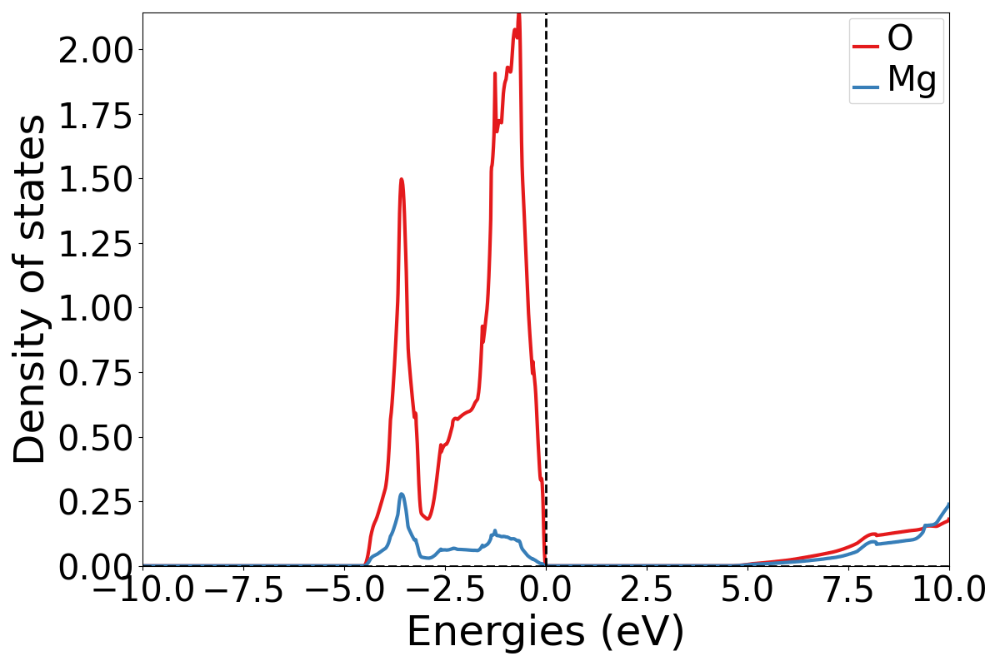
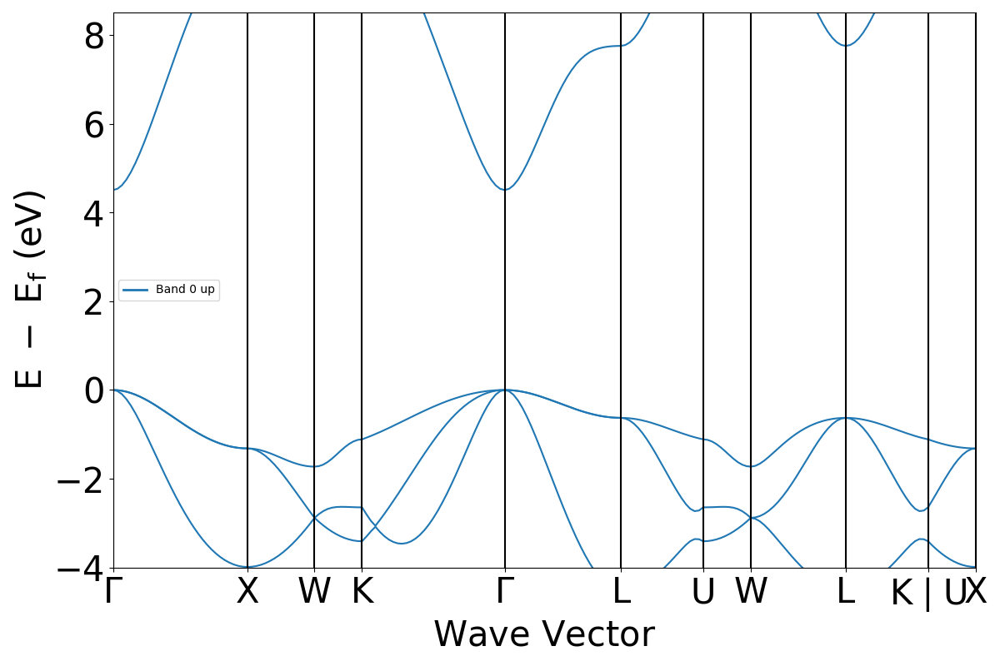

(running_workflows)=

# Running Workflows

## Introduction

Once you have a working installation of atomate2, you'll want to jump in and start
running workflows. Atomate2 includes many workflows with reasonable settings that can
get you started. This tutorial will quickly guide you through customizing and running a
workflow to calculate the band structure of MgO.

### Objectives

* Run an atomate2 workflow using Python
* Analyze the results using pymatgen

### Prerequisites

For you to complete this tutorial you need

* A working installation of atomate2.

## Bandstructure Workflows

A fundamental and common use of DFT is to calculate band structures and electronic
densities of states. Here we will use an atomate2 workflow to calculate the
bandstructure of MgO. The workflow consists of 4 parts:

1. A structural optimisation.
2. A self-consistent static calculation on the relaxed geometry.
3. A non-self-consistent calculation on a uniform k-point mesh (for the density of
   states).
4. A non-self-consistent calculation on a high symmetry k-point path (for the line mode
   band structure).

## Running a Bandstructure Workflow

### Setup

Make sure you have completed the installation tutorial. Next, create a folder on your
HPC resource for this tutorial. It can be located anywhere that you can submit and run
jobs. You'll keep all of the files for this tutorial there.

### Create the workflow in Python

Workflows in atomate2 are composed of two objects:

* Jobs: A single unit of computation. Roughly speaking, each `job` corresponds to one
  VASP calculation.
* Flows: A collection of `jobs` connected together. The band structure workflow we are
  running is an example of a `flow`. `Flows` can be nested, for example, you could
  have multiple band structure `flows` in a single workflow.

A list of all VASP workflows (which covers both jobs and flows) is given in the
[](vasp_workflows) section of the documentation. Workflows are created
using `Maker` objects. These return the workflows that can be executed later.

In this example, we will use the {obj}`RelaxBandStructureMaker` to construct our
workflow.

Create a Python script named `mgo_bandstructure.py` with the following contents:

```py
from atomate2.vasp.flows.core import RelaxBandStructureMaker
from jobflow import run_locally
from pymatgen.core import Structure

# construct a rock salt MgO structure
mgo_structure = Structure(
    lattice=[[0, 2.13, 2.13], [2.13, 0, 2.13], [2.13, 2.13, 0]],
    species=["Mg", "O"],
    coords=[[0, 0, 0], [0.5, 0.5, 0.5]],
)

# make a band structure flow to optimise the structure and obtain the band structure
bandstructure_flow = RelaxBandStructureMaker().make(mgo_structure)

# run the job
run_locally(bandstructure_flow, create_folders=True)
```

(running_the_workflow)=

### Running the workflow

Similar, to the installation tutorial, now create a job script to execute the workflow.
Write your job script to the `job.sh` file. For example, on the Grid Engine queue
system, your job script would look something like:

```bash
#!/bin/bash -l
#$ -N relax_si
#$ -P my_project
#$ -l h_rt=1:00:00
#$ -l mem=4G
#$ -pe mpi 16
#$ -cwd

# ensure you load the modules to run VASP, e.g., module load vasp

conda activate atomate2
python mgo_bandstructure.py
```

Finally, submit the job to the queue using the normal scheduler command. For example
on the Grid Engine scheduler, this would be using `qsub job.sh`.

Once the job is finished, you can check that the workflow completed successfully by
checking the standard output and error files produced by the job script.

Provided there weren't any errors, the workflow has successfully finished and the
results will be in your database.

## Analyzing a Bandstructure Workflow

Finally, we'll plot the results that we calculated. Simply run the following Python
code, either as a script or on the Python prompt.

```py
from jobflow import SETTINGS
from pymatgen.electronic_structure.plotter import DosPlotter, BSPlotter
from pymatgen.electronic_structure.dos import CompleteDos
from pymatgen.electronic_structure.bandstructure import BandStructureSymmLine

store = SETTINGS.JOB_STORE
store.connect()

# get the uniform bandstructure from the database
result = store.query_one(
    {"output.task_label": "non-scf uniform"},
    properties=["output.vasp_objects.dos"],
    load=True,  # DOS stored in the data store, so we need to explicitly load it
)
dos = CompleteDos.from_dict(result["output"]["vasp_objects"]["dos"])

# plot the DOS
dos_plotter = DosPlotter()
dos_plotter.add_dos_dict(dos.get_element_dos())
dos_plotter.save_plot("MgO-dos.pdf", xlim=(-10, 10))

# get the line mode bandstructure from the database
result = store.query_one(
    {"output.task_label": "non-scf line"},
    properties=["output.vasp_objects.bandstructure"],
    load=True,  # BS stored in the data store, so we need to explicitly load it
)
bandstructure = BandStructureSymmLine.from_dict(
    result["output"]["vasp_objects"]["bandstructure"]
)

# plot the line mode band structure
bs_plotter = BSPlotter(bandstructure)
bs_plotter.save_plot("MgO-bandstructure.pdf")
```

If you open the saved figures, you should see a plot of your DOS and bandstructure!





## Conclusion

In this tutorial, you learned how to run a band structure workflow and plot the outputs.

To see what workflows can be run, see the [](vasp_workflows). They
can be set up and run in the same way as in this tutorial.

At this point, you might:

* Learn how to chain workflows together: [](connecting_vasp_jobs).
* Learn how to customise VASP input settings: [](modifying_input_sets).
* Learn more about [Document Models and Schemas](docs_schemas_emmet)
* Configure atomate2 with FireWorks to manage and execute many workflows at once:
  [](atomate2_fireWorks).
